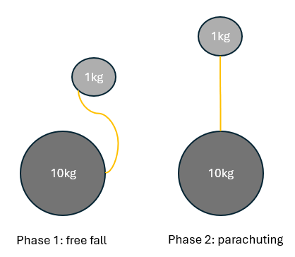

# Introduction to Computational Modelling

## What is computational modelling?

### Computer Simulations as Thought Experiments

René Descartes (1596-1650) in his _Meditations_ raises the superiority of the mind (_res cogitans_) over the matter (_res extensa_). The reason is that matter does not tell the _true nature_ of an object because it can too easily change its form under external influences. A good example is the wax. Wax under the influence of heat can change its shape and its color. In contrast, the mind is supposed to unveil the _true nature_ of objects through its activity, which is thinking.

Many philosophers and scientists align with that perspective. The most prominent scientist is surely Galileo Galilei who started describing the physical world through mathematical formula. Beyond maths, he also entertained some thought experiments in which, without any experiment, he used sheer logic to understand the physical world. For instance, do you think that a heavier object falls faster than a lighter object? Many thinkers used to think that (e.g., Aristotle). Now, suppose a heavier object falls faster than a lighter one. If you knot a rope around a light stone (1kg) and a heavy stone (10kg), what would happen? The heavier stone should go down faster than the lighter one. At some point, the rope will stretch to its maximum and the light stone should act as a parachute for the heavier stone. So the heavy stone should slow its fall because of the light stone. Yet, the combination of the two stones is heavier than the heavy stone itself (11kg + the rope). So the whole should fall faster than if the heavy stone was alone. Consequently, the heavy stone falls slower and faster than when it is alone. That is absurd. So, no, a heavier object doesn't fall faster than a lighter one.

<figure><figcaption>
Thought experiment: if heavier objects fell faster...
</figcaption></figure>

In essence, computational modelling displays the same advantage while going further. Because a part of the logic of the models it creates will be automatically checked by the computer, computational modelling basically helps the scientist do the maths or the reasoning for them. Additionally, the process for using computational modelling is quite simple. We can summarize it as trying to recreate an experiment in silico.

Computational modelling has the advantage of expliciting the assumptions of the scientist behind it. On the other hand, computational simulation has a more holistic advantage in science by achieving four functional roles (see Drogoul et al. 2008):

* Checking the internal coherence of a theory (ie doing the maths and raising absurdities);
* Helping expand models and theories by comparing them (like for thought experiments);
* Substituting experimentation when one cannot carry experiment because it is unfeasible or unethical;
* Helping experimentation by narrowing down which is the next experiment to carry out or assisting in interpreting the results.

### Computational Modelling Is a Different Type of Explanation

#### Description

In functionalism, we try to understand the world as a system being in a given state that receives inputs to transform into outputs. A computational model is often (but not always) implemented to give results of simulations. As such, it will surely be implemented on something that could be described by those three elements: states, inputs, and outputs. Nonetheless, computational models are not necessarily implemented because they give something else by themselves. They give a different kind of explanation than we are recently used to. Indeed, Marr and Poggio (1971) are at the origin of the computational modelling of neurosciences, and their conceptualization can be generalized to computational modelling at broad. They divide a computational model of a thing X into three distinct levels:

* The problem level: What is the thing X achieving on its own? What is the purpose, the functional role, the goal, or the causal efficacy of this thing X?
* The algorithmic level: How does this thing X solve that problem? What are the kinds of computations that are done?
* The implementation level: How is the algorithm implemented? On what is the algorithm implemented (e.g., biological neurons vs computers)? Is that implementation realistic, in the sense that biological neurons, computers, or whatever can achieve those computations?

Let us give an example. You want to go from A (e.g., your apartment) to B (e.g., the campus) on the map through the shortest path. However, you do not remember how to achieve this. That is the problem level. Now, you think about a way to solve that issue. There are several ways to find the shortest path: you can either start from A to go to B or start from B to go to A. The results may be the same but the process is different. Suppose you take a physical map and draw the line going from A to B since this is the fastest way to go. After some arrangements to avoid buildings, you will find a short path to travel. That is the algorithmic level. Finally, the tool you used to draw the line could be a pencil or a pen. That is the implementation level. (Obviously, you do not want to ruin your map so you would certainly use a pencil).

Importantly, these levels can also interact. The implementation options can reciprocally help you choose the algorithm to use. The precedent example would not hold if you do not possess any physical map or pencil. The algorithm can also help clarify the problem. For instance, do you travel by foot, by car or by public transport? Do you really want the optimal shortest path or is an approximation enough?

#### A Critic

It is important to outline that this kind of explanation has long been an outcast from scientific inquiries. Its ancestor may be the Aristotelian methodology of the four causes to describe to discover the _true nature_ of an object. To put it in a nutshell, one of those causes is the final cause (the _telos_ or the end) of the object. This was deemed unscientific at least after Descartes in the 17th century who advocated for mechanical explanations (ie physical interactions between objects translated into forces to explain what they do). Intuitively, to explain the fall of a stone, we do not assume like Aristotle that the stone will complete its nature by lying on the ground, thereby fulfilling the order of the world. Consequently, we know at least that not all objects of inquiry can have a scientifically satisfying problem level.

A problem level could be imagined in biology through an evolutionary perspective: some biological phenomenon serves a functional role in increasing the survival fitness of its organism. Yet, the functional role appears after the implementation, not the reverse (which would be the long-refuted theory of Lamarck). Also, even if a biological phenomenon fulfills a functional role, it is not always adaptive (e.g., people who are tall and may have been better able to defend themselves, now have to fold in two in the Tube...).

Finally, this functional role opens up some arbitrariness in the interpretation of the results. Different scientists can try to solve different problems instead of focusing on the data at hand. Moreover, the comparison of models is conditioned on the modeller's goals, even if traditional criteria exist (Manson 2003). Those traditional criteria are:

* Correctness or Correspondance: model structure and outcomes must be similar to those of the target system.
* Consistency or Coherence: the model must be internally consistent and match the conceptual framework in order to describe the target system.
* Universality: the model should apply to circumstances beyond those described by the calibration data.
* Novelty: a model should create new knowledge or outcomes.
* Simplicity: when choosing between two models, all other things being equal, the less complicated model is preferable (which is also relevant for checking the consistency of the model since it makes it more interpretable by the user)
